

# Gaser Ashraf
My personal website include information about me, education, main projects, skills and achievements...
## 💻 Build with
* html5
* sass
* javascript
* bootstrap 4

## 📷 Screen Shots
### 🌙 Dark Theme
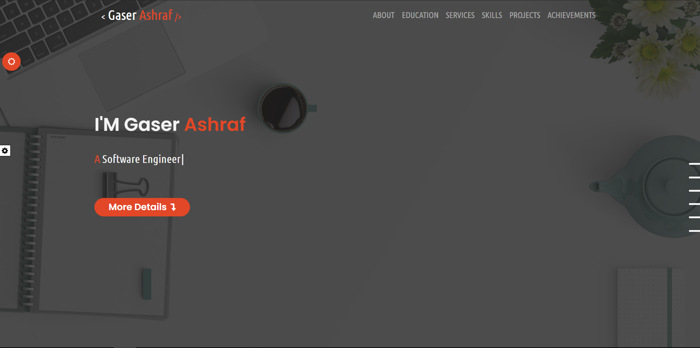
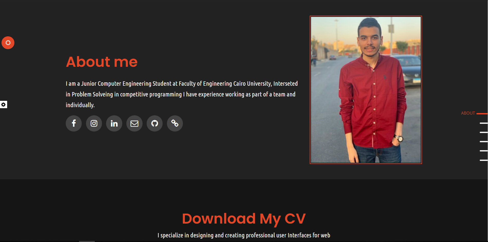

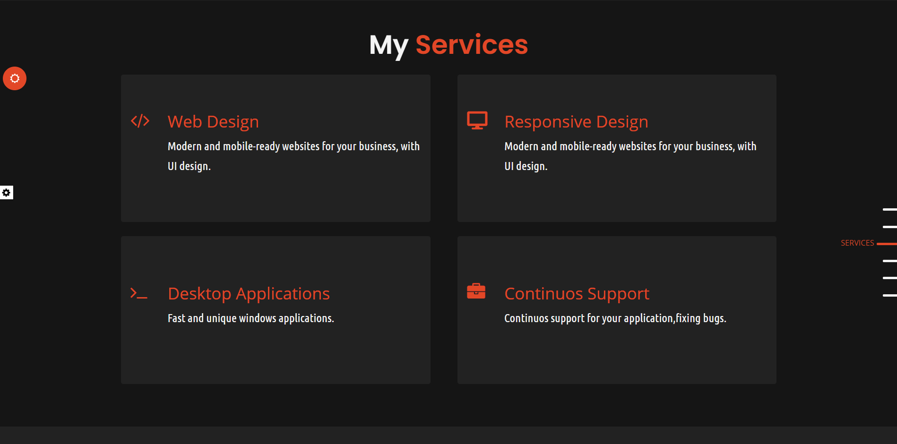
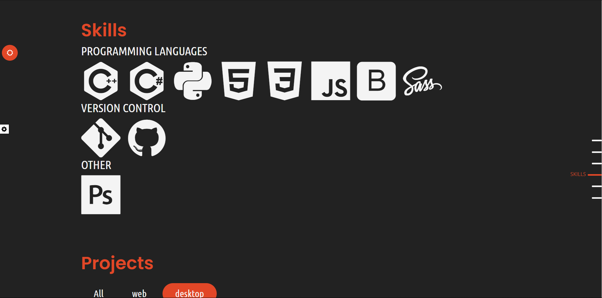
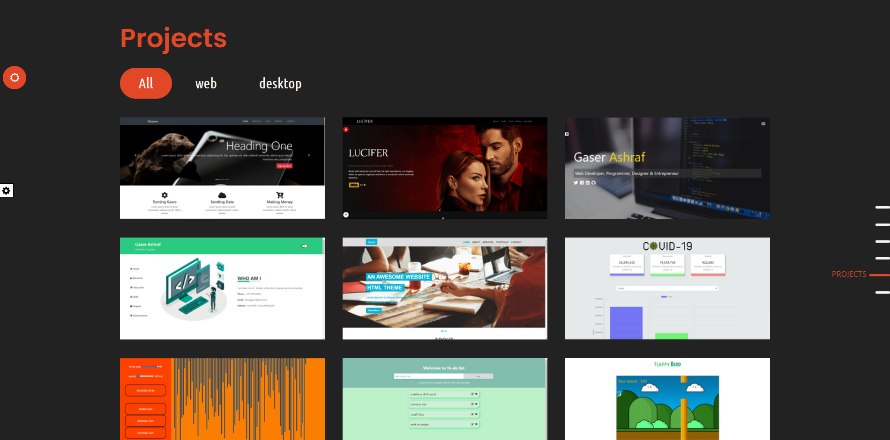
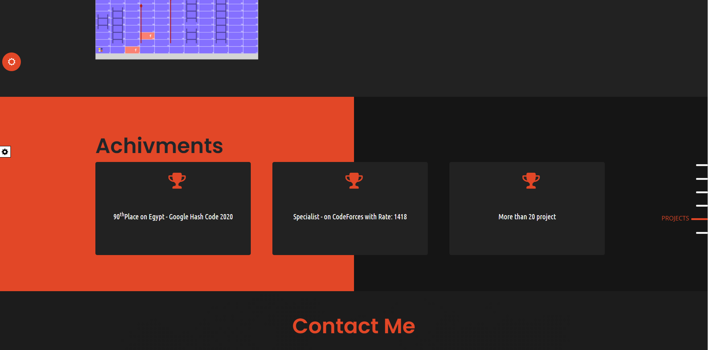
### 🌞 Light Theme

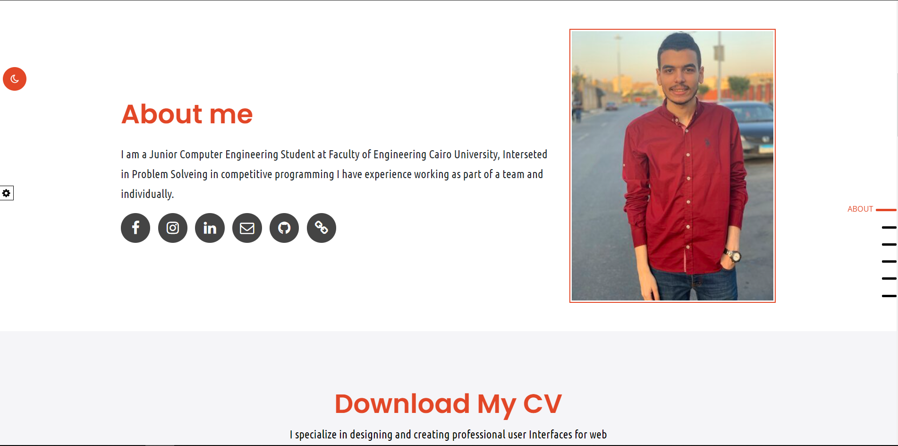

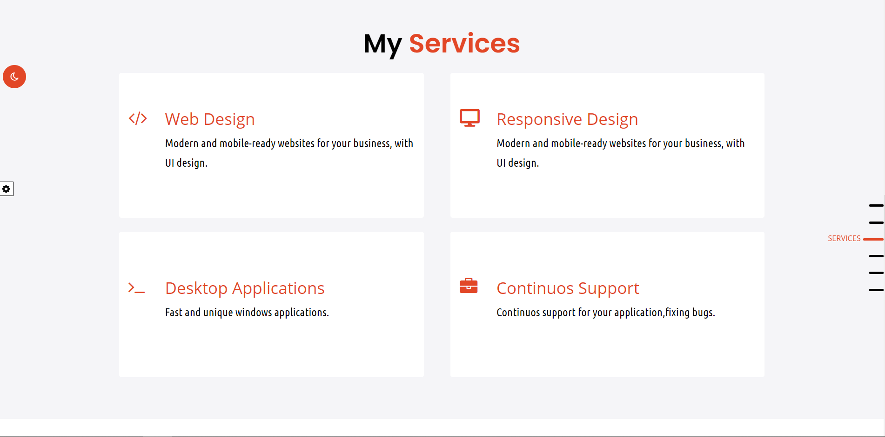
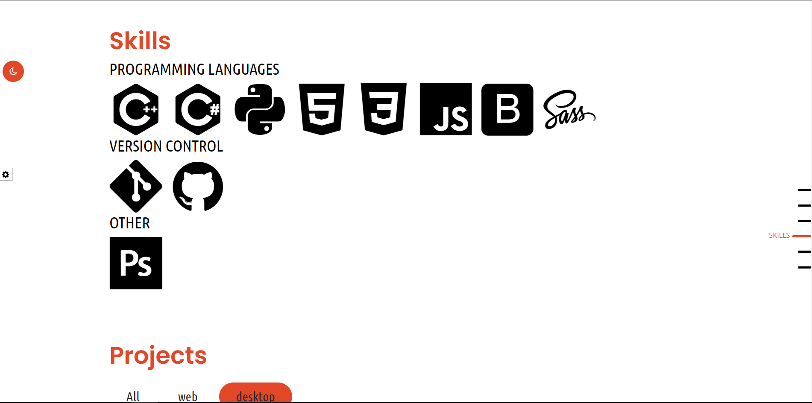
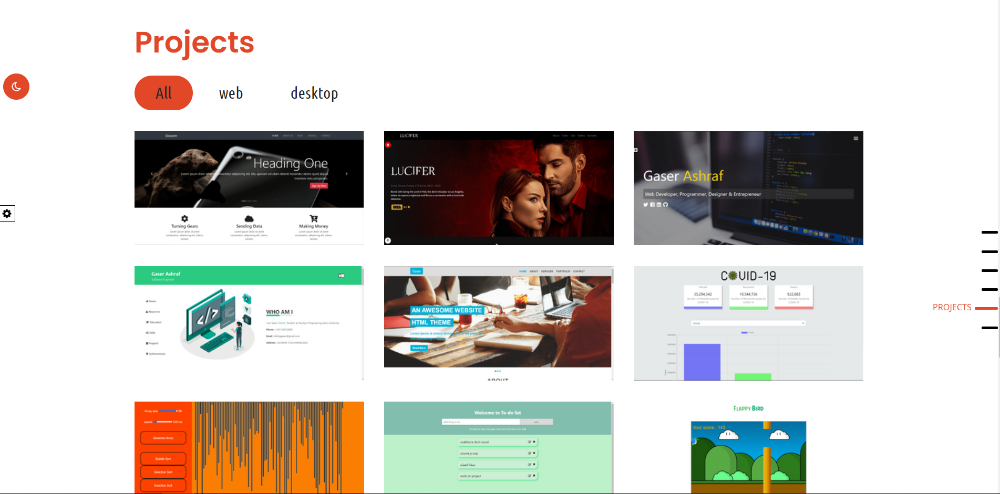
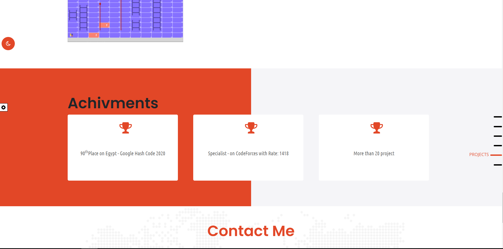
